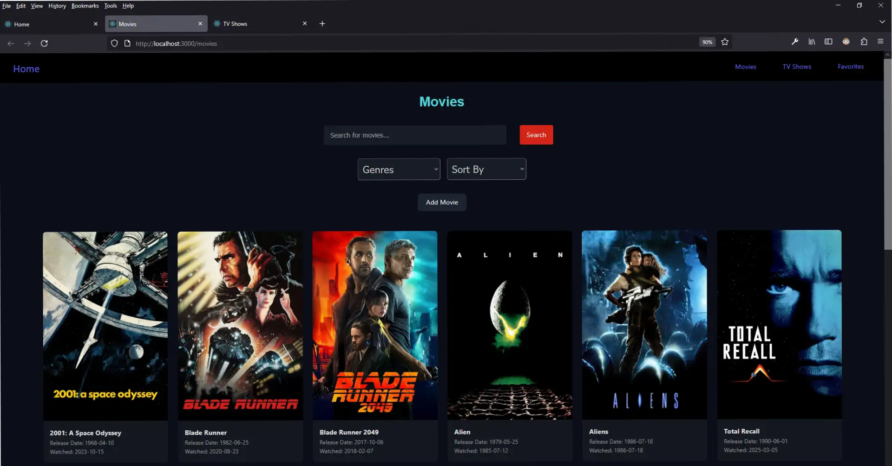

# Movie and TV Show Catalog

Full-stack movie and TV show catalog app built with the MERN stack (MongoDB, Express.js, React, and Node.js). Provides users with an interactive platform to manage their movie and TV show collection.  

## Features

- ✨Fully **OFFLINE** or web application
- Home page with upcoming movies and TV shows
- Separate pages for movies, TV shows, and favorites
- Add, delete, and edit movies, TV shows, and their genres
- Search for movies and TV shows 
- Filter by movies and TV shows by genres 
- Sort movies and TV shows by title, released date, or watched date

## Preview

<p align="center" width="100%">
  
</p>
<p align="center" width="100%">
  
</p>
<p align="center" width="100%">
  
</p>
You can select favorites by clicking on the heart icon in the upper right corner of movie or TV show image as shown below.  
<p align="center" width="100%">
  
</p>
All the favorites selected are saved and shown on the Favorites page.
<p align="center" width="100%">
  
</p>
Clicking on a movie or TV Show image pops up a dialog window with more information on the movie. You can also edit this information or delete the record in the MongoDB.
<p align="center" width="100%">
  
</p>

## Table of Contents
- [Prerequisites](#prerequisites-heading)
- [Dependencies](#dependencies-heading)
- [Installation](#installation-heading)
- [Usage](#usage-heading)


<a name="prerequisites-heading"></a>
## Prerequisites
- Node.js (tested in version 22.14.0)
- Express.js (tested in 5.1.0)
- MongoDB (tested in version 8.0.8)
- React (tested in version 19.1.0)

<a name="prerequisites-heading"></a>
## Dependencies

### Backend
- Node.js (version 22.14.0)
- MongoDB (version 8.0.8)
- Express.js (version 5.1.0)
- mongoose (version 8.13.2)
- multer (version 1.4.5-lts.2)
- dotenv (version 16.5.0)

### Frontend

- React (version 19.1.0)
- react-toastify (version 11.0.5)

<a name="installation-heading"></a>
## Installation

### Backend

The MongoDB Community Edition can be downloaded and installed locally using this [Guide](https://www.mongodb.com/docs/manual/administration/install-community/).

Node.js, including npm (Node Package Manager), can also be downloaded [here](https://nodejs.org/en/download) and installed locally.  

Once the Node.js installation is complete, open your command prompt to confirm that Node has been successfully installed by typing in the folowing in your command prompt:

```console
> node -v
```

Change the current directory to the `backend` folder

```console
> cd ./backend
```

The backend dependency list in the package.json file can be installed with a single console command:
```console
> npm install
```

### Frontend

Change the current directory to the `frontend` folder:

```console
> cd ./frontend/
```

React and the frontend dependency list in the package.json file can be installed with a single console command:
```console
> npm install
```

<a name="usage-heading"></a>
## Usage

### Backend

1. Change directory to `./backend`
2. Type the command `npm run dev` to run


### Frontend

1. Change directory to `./frontend`
2. Type the command `npm start` to run
3. The app can be viewed in a web browser at the the address http://localhost:3000


